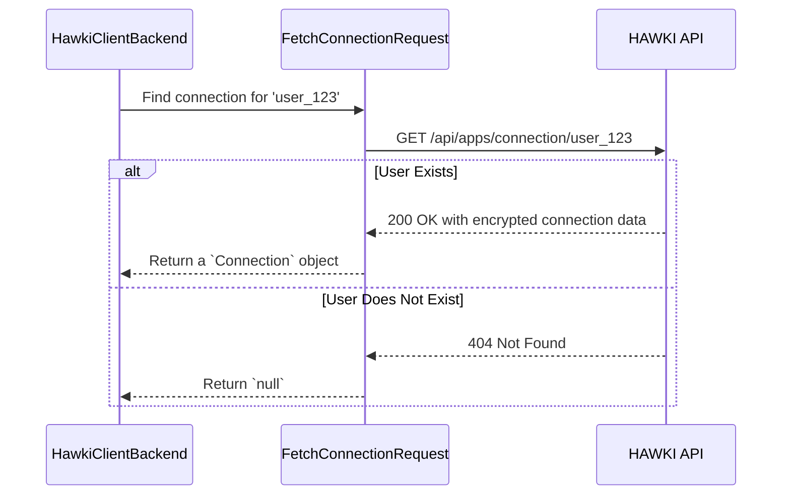
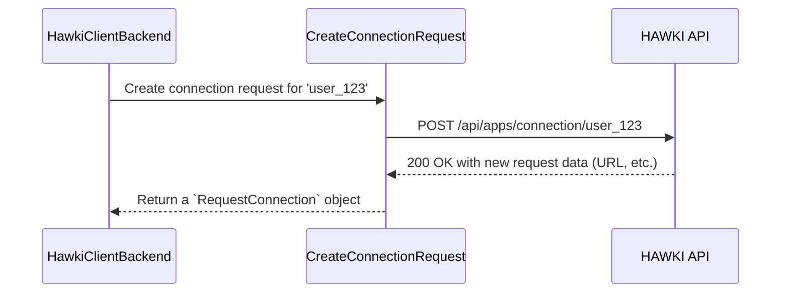

# Chapter 4: API Request Layer: The Messengers

In [Chapter 3: `ClientConfig`: The Standardized Payload](clientconfig-the-standardized-payload-335005859.md), we saw how the library packages data into a standardized envelope before sending it to the frontend. We know that the [Chapter 1: `HawkiClientBackend`: The Main Orchestrator](hawkiclientbackend-the-main-orchestrator-840305559.md) is responsible for getting this data, but we've treated *how* it gets it as a bit of a magic trick.

How does the `HawkiClientBackend` actually talk to the remote HAWKI API? Does it just have a bunch of messy HTTP code inside?

Of course not! The library uses a clean design where specific, single-purpose classes handle all the API calls. Think of the `HawkiClientBackend` as a busy manager. The manager doesn't run every errand personally. Instead, they have a team of trusted messengers, each with a single, specific job.
- One messenger's job is to **fetch** existing reports.
- Another messenger's job is to **create** new request forms.

This is exactly what the API Request Layer does. It's a collection of "messenger" classes that handle the low-level communication with the HAWKI API, keeping our main orchestrator clean and focused on its primary job: making decisions.

### Messenger 1: `FetchConnectionRequest` (The Scout)

Imagine our manager (`HawkiClientBackend`) needs to know the status of a user. The first question is always: "Is this user already connected?"

The manager dispatches a specialist scout: the `FetchConnectionRequest` class. Its one and only job is to go to the HAWKI API and ask this question.

This scout is smart. It knows there are two possible answers:
1.  **"Yes, here is the user's file."** (An HTTP `200 OK` response with their data).
2.  **"Sorry, I've never heard of this user."** (An HTTP `404 Not Found` response).

Crucially, the scout is trained to handle the "Not Found" answer without causing a panic. It simply returns to the manager and reports, "I found nothing." In code, this means it returns `null`.

Let's see the scout's mission in action.



The code that performs this is lean and focused.

**File: `src/Request/FetchConnectionRequest.php`**
```php
public function execute(ClientInterface $client): Connection|null
{
    try {
        // ... send GET request for the user ...
        $response = $client->send(
            new Request('GET', 'api/apps/connection/' . $this->localUserId)
        );
        $data = json_decode((string)$response->getBody(), true);
        return new Connection($data); // Found it! Return a Connection.
    } catch (ClientExceptionInterface $e) {
        // Did we get a "404 Not Found" error?
        if ($e->getCode() === 404) {
            return null; // Yes. This is normal, so just return null.
        }
    }
}
```
This small piece of logic is incredibly important. It turns a "hard" HTTP error (`404 Not Found`) into a "soft" application response (`null`), which the `HawkiClientBackend` can easily check in an `if` statement.

### Messenger 2: `CreateConnectionRequest` (The Registrar)

So, what happens when the scout comes back empty-handed (with `null`)? The manager (`HawkiClientBackend`) now knows the user isn't connected. The next step is to invite them.

For this, the manager dispatches a different specialist: the `CreateConnectionRequest` class, our "Registrar." This messenger's job is to go to the HAWKI API with a simple instruction: "Please create a new connection invitation for this user."

Unlike the scout, the registrar expects its mission to succeed. If this request fails, something is genuinely wrong (like the API server being down), and it will report an error immediately.



Let's look at the registrar's code. It's even simpler because it doesn't need to handle a "Not Found" case.

**File: `src/Request/CreateConnectionRequest.php`**
```php
public function execute(ClientInterface $client): RequestConnection
{
    // Send a POST request to create the connection
    $response = $client->send(
        new Request('POST', 'api/apps/connection/' . $this->localUserId)
    );

    $data = json_decode((string)$response->getBody(), true);

    // Success! Return the invitation.
    return new RequestConnection($data);
}
```
This messenger makes a `POST` request. If it's successful, it wraps the data in the simple `RequestConnection` object we learned about in [Chapter 2: Connection State: `Connection` & `RequestConnection`](connection-state-connection-requestconnection-1400742608.md) and returns it.

### How the Manager Uses Its Messengers

Now that you've met the messengers, the logic inside `HawkiClientBackend` will be crystal clear. It's just a simple sequence of giving orders.

Let's look at that code from Chapter 1 again, but now with a full understanding of what's happening.

**File: `src/HawkiClientBackend.php`**
```php
// Inside the getClientConfig() method...

// 1. Send the scout.
$payload = (new FetchConnectionRequest($localUserId))->execute($this->client);

if ($payload) {
    // 2a. The scout found something! We have a Connection.
    $payload = $payload->decrypt($this->hybridCrypto, $this->privateKey);
} else {
    // 2b. The scout came back empty-handed. Time to send the registrar.
    $payload = (new CreateConnectionRequest($localUserId))->execute($this->client);
}
```
And just like that, the complex process of talking to an API is reduced to a simple, readable `if/else` block. This is the power of abstraction and assigning classes to single responsibilities.

### Conclusion

You've just pulled back the curtain on how `hawki-client-backend-php` neatly manages its API calls.

-   The library uses **specialized "messenger" classes** to handle all HTTP communication.
-   **`FetchConnectionRequest`** acts like a scout, safely checking for an existing user and gracefully handling a `404 Not Found` by returning `null`.
-   **`CreateConnectionRequest`** acts like a registrar, creating a new connection request when one is needed.
-   This design keeps the main `HawkiClientBackend` class clean, readable, and focused on **orchestration**, not low-level details.

We've mentioned a few times that when `FetchConnectionRequest` finds a user, the returned `Connection` object contains encrypted data. In the code snippet above, we even see a call to `$payload->decrypt()`. How does this secure decryption work, and what keys are involved? That's the final piece of the puzzle.

Next up: [Chapter 5: The Encryption Workflow](the-encryption-workflow-262429037.md)

