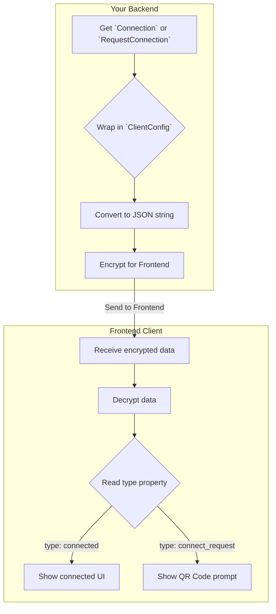

# Chapter 3: `ClientConfig` (The Standardized Payload)

In the [previous chapter](hawkiclientbackend-the-main-orchestrator_1464278974.md), we saw how the `HawkiClientBackend`
class acts as a master orchestrator. It does all the hard work and prepares a secure, encrypted package for your
frontend client.

But what's *inside* that encrypted package? After the frontend decrypts it, how does it know what to do with the data?
Should it show the user's connected status, or should it display a QR code to prompt a new connection?

The answer lies in a simple, elegant little package called `ClientConfig`.

### The Packing Slip for Your Data

Imagine you're sending a gift. You could just put the gift in a box and ship it. But what if the recipient receives two
boxes from you? One contains a birthday present, and the other contains some documents they need to sign. How do they
know which is which without opening them both and guessing?

A much better way is to put a label or a packing slip on each box: "This box contains your birthday gift," and "This box
contains important documents."

The `ClientConfig` object is exactly that: a standardized packing slip for the data being sent to the frontend. It wraps
the `Connection` or `RequestConnection` object and adds a clear label—a `type` field—that tells the frontend exactly
what's inside.

This creates a "message contract" between your backend and the frontend.

* **The Backend Promises:** "I will always package the data in this standard format with a `type` label."
* **The Frontend Knows:** "I can always check the `type` label first to understand how to handle the data inside."

After decryption, the frontend will see a simple JSON structure like one of these:

**Scenario 1: User is already connected**

```json
{
  "type": "connected",
  "payload": {
    "device": {
      "...": "..."
    },
    "secrets": {
      "...": "..."
    }
  }
}
```

The `type` is `"connected"`, so the frontend knows the `payload` contains the user's decrypted connection details. It
can now proceed to use HAWKI features.

**Scenario 2: User needs to connect**

```json
{
  "type": "connect_request",
  "payload": {
    "url": "https://hawki.example.com/connect/....",
    "expires_at": "..."
  }
}
```

The `type` is `"connect_request"`, so the frontend knows the `payload` contains the details for generating a QR code. It
will now display the connection prompt to the user.

### A Look Inside the `ClientConfig` Class

The code that creates this structure is refreshingly simple. It's a small value object whose main job is to add that
helpful `type` label.

Let's look at its constructor.

**File: `src/Value/ClientConfig.php`**

```php
public function __construct(
    public Connection|RequestConnection $payload
)
{
    $this->type = match (true) {
        $payload instanceof Connection => ClientConfigType::CONNECTED,
        $payload instanceof RequestConnection => ClientConfigType::CONNECTION_REQUEST,
    };
}
```

That's it! When you create a `ClientConfig` object, you give it either a `Connection` or a `RequestConnection`. The code
then uses a `match` expression (a modern PHP feature) to check the type of the payload and sets the `$this->type`
property accordingly.

The `ClientConfigType` is a simple helper (an `enum`) that holds the string values.

**File: `src/Value/ClientConfigType.php`**

```php
<?php

namespace Hawk\HawkiClientBackend\Value;

enum ClientConfigType: string
{
    case CONNECTED = 'connected';
    case CONNECTION_REQUEST = 'connect_request';
}
```

### The Journey of a Payload

This `ClientConfig` wrapper is the final step on the backend before the data is encrypted and sent away. Let's visualize
the entire journey, from creation in the backend to interpretation in the frontend.



As you can see, `ClientConfig` plays a small but vital role. It makes the communication between your backend and the
HAWKI frontend predictable and reliable.

### Putting It All Together

Let's revisit the final lines of the `getClientConfig` method from [Chapter 2:
`HawkiClientBackend` (The Main Orchestrator)](hawkiclientbackend-the-main-orchestrator_1464278974.md) to see this in
action.

**File: `src/HawkiClientBackend.php`**

```php
// ...inside getClientConfig()

// At this point, $payload is either a Connection or a RequestConnection.
// (We learned about this in Chapter 1 & 2)

return new EncryptedClientConfig(
    $this->hybridCrypto->encrypt(
        json_encode(new ClientConfig($payload), JSON_THROW_ON_ERROR),
        // ... public key goes here ...
    )
);
```

The logic is clear:

1. Take the `$payload` (`Connection` or `RequestConnection`).
2. Wrap it inside `new ClientConfig($payload)`.
3. Convert the whole `ClientConfig` object to a JSON string.
4. Encrypt that JSON string.

This ensures the standardized, labeled package is what gets securely sent to the frontend.

### Conclusion

You've now learned about the simple but essential "message contract" that makes the backend and frontend speak the same
language.

- **`ClientConfig`** is a wrapper that standardizes the data sent to the frontend.
- It adds a **`type` property** (`connected` or `connect_request`).
- This `type` acts as a clear **label**, telling the frontend exactly how to handle the decrypted data.

So far, we've seen that the `HawkiClientBackend` class can fetch a `Connection` or create a `RequestConnection`. But
we've treated that part like magic. How does it *actually* talk to the HAWKI API to get this information?

In the next chapter, we'll pull back the curtain and look at the specialized classes that handle the API communication.

Next up: [Chapter 4: API Request Layer (`Fetch-` &
`CreateConnectionRequest`)](api-request-layer-fetch-createconnectionrequest_22978743.md)
