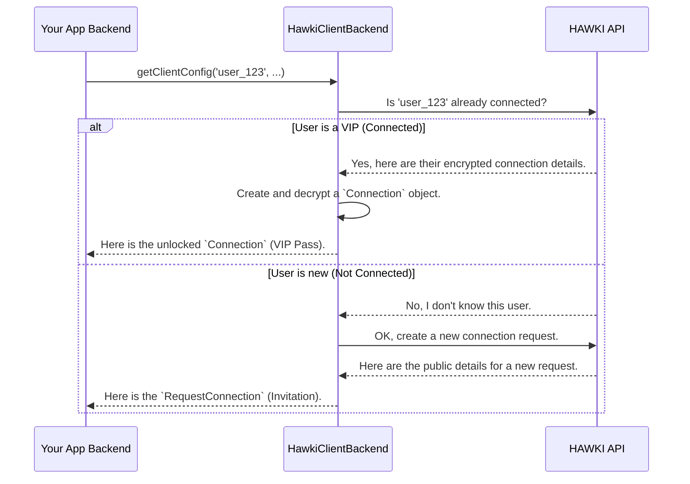

# Chapter 2: Connection State: `Connection` & `RequestConnection`

In [Chapter 1: `HawkiClientBackend`: The Main Orchestrator](hawkiclientbackend-the-main-orchestrator-840305559.md), we learned that the `getClientConfig()` method automatically figures out a user's status. It cleverly decides whether to fetch an existing connection or create a new one. But what exactly are these two different outcomes?

Let's explore the two "ID cards" that the `HawkiClientBackend` can issue for a user. Understanding them is key to seeing how the whole system works.

Imagine you're a doorman at an exclusive club. When a guest arrives, you need to check their status.
- Is this a new guest? You give them an **invitation** to sign up.
- Is this an existing member? You check their **VIP pass** to let them in.

This library uses the same logic with two special objects: `RequestConnection` (the invitation) and `Connection` (the VIP pass).

### `RequestConnection`: The Invitation

When a user visits your site for the first time and has no link to HAWKI, the `HawkiClientBackend` will produce a `RequestConnection` object. Its job is simple: it contains the information your frontend needs to display a connection prompt, like a QR code.

Think of it as the "invitation". It doesn't contain any secrets. It just has the public details for the user to establish their *first* connection.

Let's look at the class in `src/Value/RequestConnection.php`. It's beautifully simple.

```php
// File: src/Value/RequestConnection.php

readonly class RequestConnection implements \JsonSerializable
{
    public function __construct(
        private array $data
    ) {}

    // ...
}
```

That's it! It's just a read-only container for data provided by the HAWKI server. This data typically includes a unique URL that the frontend will turn into a scannable QR code. It's a one-way ticket for a new user to join the club.

### `Connection`: The VIP Pass

Now for the more powerful object. When a user is *already linked* to HAWKI, the `HawkiClientBackend` gives you a `Connection` object. This is the "VIP Pass". It’s like a locked box that holds all the sensitive, secret information for that user, such as the keys they need to interact with HAWKI-powered features.

Because this data is so sensitive, it arrives from the HAWKI server encrypted. The `Connection` object knows it's holding secrets and, crucially, it knows how to unlock them.

```php
// File: src/Value/Connection.php

class Connection implements \JsonSerializable
{
    private bool $isDecrypted = false;

    public function __construct(
        private array $data,
    ) {}

    // ... more code follows
}
```

Notice the `$isDecrypted` property. The `Connection` object starts its life in a locked (encrypted) state. You cannot use it right away. First, you must unlock it using a method called `decrypt()`, which is called for you inside the `HawkiClientBackend`.

```php
// File: src/Value/Connection.php

public function decrypt(HybridCrypto $hybridCrypto, AsymmetricPrivateKey $appPrivateKey): self
{
    if ($this->isDecrypted) {
        return $this; // Already unlocked!
    }

    // Perform the decryption using your app's secret key.
    $this->decryptSecrets($hybridCrypto, $appPrivateKey);

    $this->isDecrypted = true;
    return $this;
}
```
This method uses your application's private key (the one you provided when setting up the client) to safely decrypt the user's secrets. It's a critical security step that happens entirely on your server. We will cover the magic behind this process in [Chapter 5: The Encryption Workflow](the-encryption-workflow-262429037.md).

To prevent you from accidentally sending locked, unusable data to the frontend, the library includes a safety check. If you try to use the `Connection` object before it's decrypted, it will throw an error.

```php
// File: src/Value/Connection.php

public function jsonSerialize(): array
{
    if (!$this->isDecrypted) {
        // Stop! You can't send encrypted data.
        throw new ConnectionNotDecryptedException();
    }
    return $this->data;
}
```

This ensures that only an unlocked, ready-to-use "VIP Pass" ever gets sent forward.

### Who Decides Which Card to Issue?

As we saw in Chapter 1, you don't have to write any code to make this decision. The `HawkiClientBackend` is the smart doorman who handles this for you.

When you call `getClientConfig()`, it performs a quick check with the HAWKI API. The sequence diagram from the last chapter perfectly illustrates this:



The `HawkiClientBackend` uses dedicated "messenger" objects, which we'll cover in [Chapter 4: API Request Layer: The Messengers](api-request-layer-the-messengers-80603215.md), to have this conversation with the HAWKI API and build the correct response object for you.

### Conclusion

You've just learned about the two fundamental states of a user in the HAWKI ecosystem, represented by two distinct objects:

-   **`RequestConnection`**: A simple "invitation" for a new user, containing public data to display a connection prompt.
-   **`Connection`**: A secure "VIP Pass" for a linked user, holding encrypted secrets that are safely unlocked on your server.

The `HawkiClientBackend` masterfully determines which "card" to issue, so you always get the right data for your user's current status.

But no matter which object is created—`RequestConnection` or `Connection`—it needs to be put into a standardized envelope before being sent to the frontend. How is that done?

Next up: [Chapter 3: `ClientConfig`: The Standardized Payload](clientconfig-the-standardized-payload-335005859.md)

