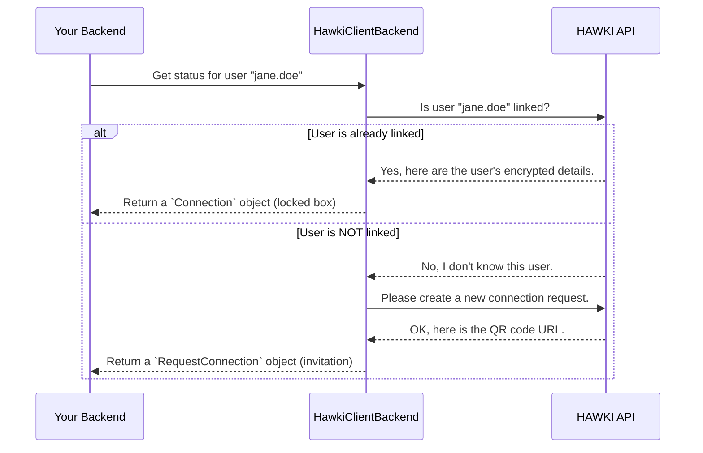

# Chapter 1: Connection State (`Connection` & `RequestConnection`)

Welcome to the `hawki-client-backend-php` tutorial! We're excited to help you get started. In this first chapter, we'll explore the very first concept you need to understand: how the library represents a user's status.

Imagine a user logs into your website. You need to answer a simple question: "Is this user already connected to HAWKI, or do we need to ask them to connect?"

This library answers that question by giving you one of two special objects: `Connection` or `RequestConnection`. Think of them as two different ID cards for your user.

1.  **`Connection`**: The "VIP Pass". This is for a user who is already linked to HAWKI. It holds all the secure details needed for them to interact with HAWKI-powered features.
2.  **`RequestConnection`**: The "Invitation". This is for a new user who isn't linked yet. It contains just enough information for your website's frontend to display a connection prompt (like a QR code).

Let's dive into what each of these "ID cards" looks like and how they work.

### `RequestConnection`: The Simple Invitation

When a user has no link to HAWKI, the library gives you a `RequestConnection` object. It's a very simple and straightforward object. Its only job is to hold the details needed to *ask* the user to connect.

Think of it as a piece of paper with a web address on it. Your frontend takes this address, generates a QR code, and shows it to the user.

Here's what the class looks like. Don't worry about the `\JsonSerializable` part; it just means this object can be easily converted into a JSON string to send to the frontend.

**File: `src/Value/RequestConnection.php`**
```php
<?php
// ...
readonly class RequestConnection implements \JsonSerializable
{
    public function __construct(
        private array $data
    ) {}

    public function jsonSerialize(): array
    {
        return $this->data;
    }
}
```
As you can see, it's incredibly simple! It just holds some data (an array) given to it by the HAWKI server and can present that data when asked. This data typically includes a unique URL for the user to scan.

### `Connection`: The Secure VIP Pass

Now for the more interesting one. When a user is *already linked* to HAWKI, you get a `Connection` object. This object is like a locked box. It contains valuable, secret information for that specific user, such as their private API keys.

Because this information is so sensitive, it arrives from the HAWKI server in an encrypted format. The `Connection` object knows it's holding secrets and, more importantly, it knows how to decrypt them securely on your server.

**File: `src/Value/Connection.php`**
```php
<?php
// ...
class Connection implements \JsonSerializable
{
    private bool $isDecrypted = false;
    
    public function __construct(
        private array $data,
    ) {}
    
    // ... more code here
}
```
The `Connection` object starts its life with encrypted data. You can't use it right away. You first need to "unlock" it using a special method called `decrypt()`.

```php
<?php
// ... inside the Connection class

public function decrypt(HybridCrypto $hybridCrypto, AsymmetricPrivateKey $appPrivateKey): self
{
    if ($this->isDecrypted) {
        return $this;
    }
    
    $this->decryptSecrets($hybridCrypto, $appPrivateKey);
    $this->isDecrypted = true;
    
    return $this;
}
```
This `decrypt` method is the key to unlocking the box. It uses your application's private key to safely decrypt the user's secrets. We have a whole chapter dedicated to this process, so for now, just know that this is a critical step. You can learn more in [Chapter 5: Encryption Workflow](encryption-workflow_611751868.md).

Once decrypted, the `Connection` object is ready to be sent to the frontend. If you try to send it *before* decrypting, the library will stop you with an error. This is a safety feature to prevent you from accidentally leaking encrypted, unusable data.

```php
<?php
// ... inside the Connection class

public function jsonSerialize(): array
{
    if (!$this->isDecrypted) {
        throw new ConnectionNotDecryptedException();
    }
    
    return $this->data;
}
```

### How Does the Library Decide Which One to Create?

You might be wondering, "How does the system know whether to give me a `Connection` or a `RequestConnection`?" You don't have to worry about this logic—it's handled for you!

The main class, which we'll explore in the next chapter, does all the heavy lifting. Here’s a simplified overview of what happens behind the scenes.



The core logic asks the HAWKI API about your user.
*   If the user is known, the API sends back their encrypted data, and the library creates a `Connection` object.
*   If the user is unknown, the library automatically asks the API to create a new connection request and uses that information to create a `RequestConnection` object.

Both of these outcomes are then neatly packaged into a standard format for the frontend, which you'll learn about in [Chapter 3: `ClientConfig` (The Standardized Payload)](clientconfig-the-standardized-payload_1483722428.md).

### Conclusion

You've just learned the most fundamental concept in `hawki-client-backend-php`: the two states of a user.

- **`RequestConnection`**: A simple object for a new user, telling your frontend to show a connection prompt.
- **`Connection`**: A secure object for a linked user, holding their encrypted secrets that can be safely decrypted on your server.

Understanding this distinction is the first step to integrating HAWKI. You now know what to expect when you ask the library for a user's status.

In the next chapter, we'll introduce the main orchestrator that makes all of this happen.

Next up: [Chapter 2: `HawkiClientBackend` (The Main Orchestrator)](hawkiclientbackend-the-main-orchestrator_1464278974.md)

