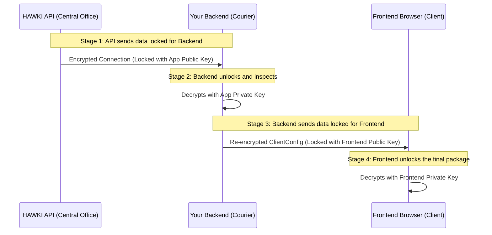

# Chapter 5: Encryption Workflow

In the [previous chapter](api-request-layer-fetch-createconnectionrequest_22978743.md), we learned how the "messenger" classes `FetchConnectionRequest` and `CreateConnectionRequest` communicate with the HAWKI API. We saw that when `FetchConnectionRequest` finds an existing user, it returns a `Connection` object containing encrypted data.

But why is this multi-step process of decrypting and re-encrypting data so important? Why not just pass the data through?

This chapter dives into the heart of the library's security model: the "decrypt-then-re-encrypt" workflow. This process is designed to ensure that a user's sensitive secrets—like their personal API token—are never exposed in a readable format anywhere outside of their own browser.

### The Problem: Sending Secrets Safely

Imagine you need to send a highly confidential document from a central office (the HAWKI API) to a specific client (the frontend/browser). You have a trusted courier (your backend) who will handle the delivery.

If the central office gives the document directly to the courier in a plain envelope, anyone who intercepts the courier could read it. That's not secure.

Instead, a two-part security process is needed:
1.  The central office puts the document in a box and locks it with the **courier's key**.
2.  The courier opens the box, verifies the contents, puts them into a **new box**, and locks it with the **client's key**.

This way, the document is always inside a locked box during its journey. Only the courier can open the first box, and only the final client can open the second one. This is exactly how the `hawki-client-backend-php` library handles secrets.

### The Two-Lock Encryption Workflow

This library's encryption workflow can be broken down into four main stages, which mirror our courier analogy perfectly.



Let's look at each stage in detail.

#### Stage 1 & 2: Decrypting the Data from HAWKI

When your backend (the courier) asks the HAWKI API for a user's details, the API sends back a `Connection` object. The sensitive parts inside, like the user's `apiToken`, are encrypted. They are "locked" using your **Application's Public Key**.

Your backend is the only one who has the matching **Application Private Key**. It uses this key to "unlock" the data. This is exactly what happens when you call the `decrypt()` method on a `Connection` object.

Let's look at the code in `HawkiClientBackend` that handles this.

**File: `src/HawkiClientBackend.php`**
```php
// Inside getClientConfig()...
$payload = (new FetchConnectionRequest($localUserId))->execute($this->client);

if ($payload) {
    // Stage 1 & 2 happen here!
    // The payload is a Connection object with encrypted data.
    // We decrypt it using our application's private key.
    $payload = $payload->decrypt($this->hybridCrypto, $this->privateKey);
}
```
The `$this->privateKey` here is your application's secret private key. It's the key to the first lockbox. This call reaches into the `Connection` object and uses your private key to securely read the user's secrets.

**File: `src/Value/Connection.php`**
```php
private function decryptSecrets(HybridCrypto $hybridCrypto, AsymmetricPrivateKey $appPrivateKey): void
{
    // ...
    // Decrypt the user's API token using our app's private key
    $decryptedApiToken = $hybridCrypto->decrypt(
        HybridCryptoValue::fromString($this->data['secrets']['apiToken']),
        $appPrivateKey
    );
    $this->data['secrets']['apiToken'] = $decryptedApiToken;
    // ... and so on for other secrets ...
}
```
At this point, the user's secrets are (briefly) in memory on your server in a decrypted state. Now your server can prepare the final package for the frontend.

#### Stage 3 & 4: Re-Encrypting for the Frontend

Now that your backend has the verified, decrypted information, it can't just send it to the frontend. That would be like the courier taking the document out of the first box and handing it over unprotected!

Instead, your backend must put the data into a new "lockbox" intended only for the final recipient—the user's browser. To do this, it needs the **Frontend's Public Key**. The frontend client generates a unique key pair for each session and sends its public key with the very first request.

Your backend takes the entire payload (wrapped in a [Chapter 3: `ClientConfig` (The Standardized Payload)](clientconfig-the-standardized-payload_1483722428.md)), and encrypts it using this frontend public key.

This step happens at the very end of the `getClientConfig()` method.

**File: `src/HawkiClientBackend.php`**
```php
// ... final part of getClientConfig()
return new EncryptedClientConfig(
    // Stage 3 happens here!
    $this->hybridCrypto->encrypt(
        json_encode(new ClientConfig($payload), JSON_THROW_ON_ERROR),
        $this->asymmetricCrypto->loadPublicKeyFromWeb($publicKey) // The frontend's public key!
    )
);
```
The `$publicKey` variable holds the public key sent from the browser. The result is a secure, encrypted package that can be safely sent over the internet.

Finally, in **Stage 4**, the frontend client receives this encrypted package. Since it has the matching private key, it can unlock the package and securely access the configuration and user secrets.

Your backend has successfully acted as a secure intermediary without ever exposing the secrets to eavesdroppers.

### Conclusion

You have now learned the most critical security concept in `hawki-client-backend-php`: the "decrypt-then-re-encrypt" workflow.

-   **First Decryption:** Data from the HAWKI API is decrypted on your server using your application's **private key**. This confirms the data's authenticity and lets your server inspect it.
-   **Second Encryption:** The complete payload for the frontend is re-encrypted using the frontend's temporary **public key**.
-   **Ultimate Security:** This two-lock strategy ensures that sensitive user secrets are only ever in a readable, unencrypted state in two places: briefly on your secure server, and finally inside the end user's browser. They are never exposed "on the wire."

Congratulations! You have now journeyed through all the core concepts of the `hawki-client-backend-php` library, from the high-level orchestrator down to the intricate details of its security model. You are now well-equipped to integrate HAWKI into your PHP application securely and effectively.

