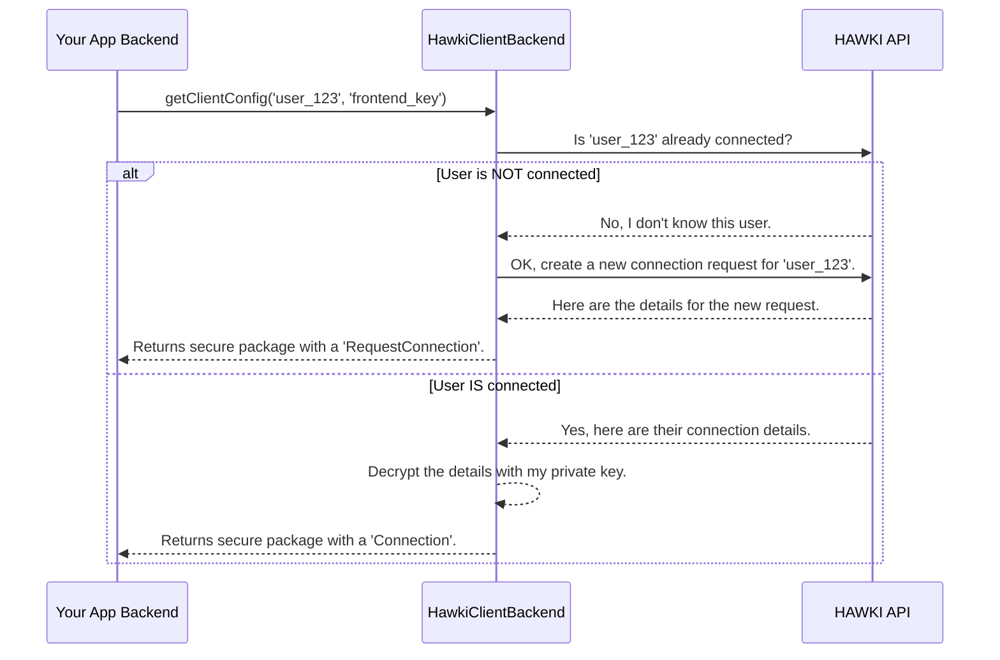

# Chapter 1: `HawkiClientBackend`: The Main Orchestrator

Having explored the local development setup with the bin/env helper in [bin/env - Your local dev helper](bin-env-your-local-dev-helper-862670637.md), we're now shifting gears to the operational core of the library.

Welcome to the `hawki-client-backend-php` library! Your main goal is to securely connect your web application's backend to its HAWKI-enabled frontend. But how do you handle all the complex API calls, user states, and end-to-end encryption?

This is where the `HawkiClientBackend` class comes in. It's the central brain of the library and the **only class you'll need to interact with directly.**

Think of it as a master chef in a busy restaurant. You, the application developer, give a simple order: "Get the secure configuration for this user." The chef (`HawkiClientBackend`) then takes over, running into the kitchen to perform a series of complex steps: talking to the HAWKI server, deciding which ingredients (data) to use, and managing all the secret keys to prepare the final, secure dish. All you have to do is serve that dish to your frontend.

### Using the Main Orchestrator

Your primary task will be to create an API endpoint in your PHP application that the frontend can call. Let's see how `HawkiClientBackend` makes this incredibly simple.

#### 1. Setting Up the Client

First, you need to create an instance of `HawkiClientBackend`. To do this, you'll need three secret credentials that you get when you register your application within your HAWKI instance:

1.  **HAWKI URL**: The web address of your HAWKI server.
2.  **API Token**: A secret "password" that allows your app to talk to the HAWKI API.
3.  **Application Private Key**: A secret key that your backend uses to decrypt messages from the HAWKI server.

It is critical to keep these values safe (e.g., as environment variables) and never write them directly in your code.

```php
use Hawk\HawkiClientBackend\HawkiClientBackend;

// Load these securely from your server's environment.
$hawkiClientBackend = new HawkiClientBackend(
    hawkiUrl: $_ENV['HAWKI_URL'],
    apiToken: $_ENV['HAWKI_API_TOKEN'],
    privateKey: $_ENV['HAWKI_APP_PRIVATE_KEY']
);
```

Just like that, your main orchestrator is ready for action!

#### 2. The One Method You Need: `getClientConfig()`

This class has one primary method that does all the work: `getClientConfig()`.

You give it two simple things:

1.  `localUserId`: The unique ID of the user from *your own application* (e.g., the user ID from your database).
2.  `publicKey`: A public key sent from the HAWKI frontend. This key ensures that only that specific user's browser can open the response.

In return, it gives you a secure, encrypted package to send back to the frontend.

```php
// In your API endpoint (e.g., /api/hawki-config)

// Your user's ID and the frontend's public key.
$localUserId = 'user_from_your_session_123';
$frontendPublicKey = $_POST['public_key'];

// Get the encrypted configuration.
$encryptedConfig = $hawkiClientBackend->getClientConfig(
    $localUserId,
    $frontendPublicKey
);

// Send the secure JSON package back to the frontend.
header('Content-Type: application/json');
echo json_encode($encryptedConfig);
```

And you're done! With just a few lines of code, you have a fully functional and secure endpoint. The library handles all the difficult API and cryptographic steps for you.

### What Happens Under the Hood?

Calling `getClientConfig()` kicks off a clever, automated process. You don't need to manage these steps, but understanding them shows the power of the library.

Here’s a simplified diagram of the conversation:



As you can see, `HawkiClientBackend` acts as a smart middleman. It asks the HAWKI API about your user and gracefully handles both possible scenarios: the user already has a connection, or they need a new one.

### A Peek at the Code

Let's look inside the `getClientConfig` method in `src/HawkiClientBackend.php` to see how this logic is implemented.

First, it creates and sends a request to check if the user is already connected. This is handled by a special-purpose "messenger" object we'll explore later.

```php
// File: src/HawkiClientBackend.php

// Step 1: Try to fetch an existing connection.
$payload = (new FetchConnectionRequest($localUserId))->execute($this->client);
```

This first line is like asking, "Does a connection for `user_123` exist?". The result is stored in the `$payload` variable. These dedicated request objects are covered in [Chapter 4: API Request Layer: The Messengers](api-request-layer-the-messengers-80603215.md).

Next comes the core decision-making logic:

```php
// Step 2: Decide what to do based on the result.
if ($payload) {
    // 2a: If a connection exists, decrypt it.
    $payload = $payload->decrypt($this->hybridCrypto, $this->privateKey);
} else {
    // 2b: If not, create a new connection request.
    $payload = (new CreateConnectionRequest($localUserId))->execute($this->client);
}
```

*   If `$payload` contains data (it's not empty), it means the user is already connected. The code decrypts the `Connection` details.
*   If `$payload` is empty (`null`), it means the user is new to HAWKI. The code creates a new `RequestConnection` for them.

We will dive into what `Connection` and `RequestConnection` objects are in the very next chapter.

Finally, no matter which path was taken, the resulting `$payload` is wrapped up, standardized, and securely encrypted for the frontend.

```php
// Step 3: Package and encrypt the final payload for the frontend.
return new EncryptedClientConfig(
    $this->hybridCrypto->encrypt(
        json_encode(new ClientConfig($payload), JSON_THROW_ON_ERROR),
        $this->asymmetricCrypto->loadPublicKeyFromWeb($publicKey)
    )
);
```

This final step ensures that the data is in a standard format using the `ClientConfig` object and is encrypted so that only the user's browser can read it. You can learn more about this standard format in [Chapter 3: `ClientConfig`: The Standardized Payload](clientconfig-the-standardized-payload-335005859.md) and the encryption magic in [Chapter 5: The Encryption Workflow](the-encryption-workflow-262429037.md).

### Conclusion

You've now met the most important class in the library, `HawkiClientBackend`. You've learned that:

*   It is your **single entry point** for all interactions with HAWKI.
*   It simplifies a complex workflow into **one method call**: `getClientConfig()`.
*   It **automatically decides** whether to fetch an existing user connection or create a new one.
*   It ensures all communication is **secure and encrypted** from end to end.

Now you know *how* `HawkiClientBackend` checks a user's status. But what exactly are the two different states it handles—the existing `Connection` and the new `RequestConnection`?

Next up: [Chapter 2: Connection State: `Connection` & `RequestConnection`](connection-state-connection-requestconnection-1400742608.md)

