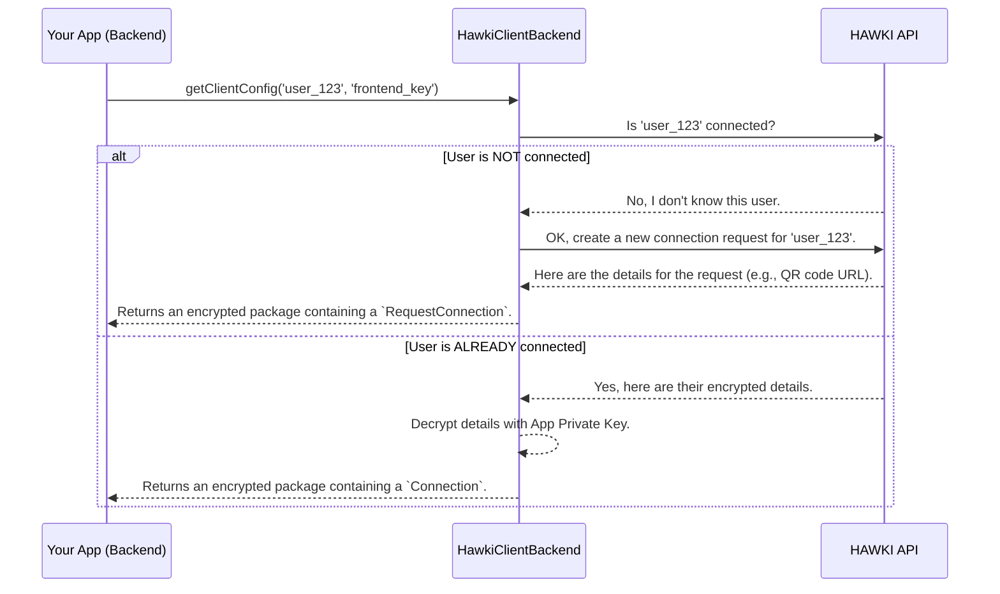

# Chapter 2: `HawkiClientBackend` (The Main Orchestrator)

In the [previous chapter](connection-state-connection-requestconnection_1088094409.md), we learned about the two possible "ID cards" a user can have: the `Connection` (VIP Pass) and the `RequestConnection` (Invitation).

Now, you might be wondering, "Who is the bouncer at the door who checks for these ID cards and creates new ones?" That bouncer is the `HawkiClientBackend` class. It's the central brain of the entire library, and it's the only class you'll need to interact with directly.

Think of it as a master chef. You give it a simple order: "Get the HAWKI status for this user." The chef then goes into the kitchen and performs a complex series of steps—talking to the HAWKI server, handling secret ingredients (keys), and preparing the final dish. All you see is the perfectly prepared meal, ready to be served.

### Using the Main Orchestrator

The main task for this class is to prepare a secure configuration package for your frontend. Let's walk through how to use it.

#### 1. Setting Up the Client

First, you need to create an instance of `HawkiClientBackend`. To do this, you'll need three secret ingredients that you get from your HAWKI instance:

1.  **HAWKI URL**: The web address of your HAWKI server.
2.  **API Token**: A secret password for your application to talk to the HAWKI API.
3.  **Application Private Key**: A secret key that proves your backend is who it says it is.

It's very important to keep these values safe, for example, as environment variables, and never write them directly in your code.

```php
use Hawk\HawkiClientBackend\HawkiClientBackend;

// Load these securely from your server's environment.
$hawkiUrl = $_ENV['HAWKI_URL'];
$apiToken = $_ENV['HAWKI_API_TOKEN'];
$appPrivateKey = $_ENV['HAWKI_APP_PRIVATE_KEY'];

$hawkiClientBackend = new HawkiClientBackend(
    hawkiUrl: $hawkiUrl,
    apiToken: $apiToken,
    privateKey: $appPrivateKey
);
```
With this, your main orchestrator is ready for action!

#### 2. The One Method You Need to Know: `getClientConfig()`

This class has one primary public method that does all the work: `getClientConfig()`.

You give it two things:
1.  `localUserId`: The unique ID of the user from *your* system (e.g., 'user_123').
2.  `publicKey`: A special public key sent from the HAWKI frontend client.

It then does everything for you and returns a secure, encrypted package to send back to the frontend.

Here's how you'd use it in a typical API endpoint in your application:

```php
// In your API endpoint (e.g., /api/hawki-config)

// Get your user's ID and the frontend's public key.
$localUserId = 'user_from_your_session_123';
$frontendPublicKey = $_POST['public_key'];

// Get the encrypted configuration.
$encryptedConfig = $hawkiClientBackend->getClientConfig(
    $localUserId,
    $frontendPublicKey
);

// Send it back to the frontend.
header('Content-Type: application/json');
echo json_encode($encryptedConfig);
```
That's it! With one method call, you've handled a complex API and cryptographic workflow. The `$encryptedConfig` variable contains a secure payload that only the user's browser can open.

### What Happens Under the Hood?

Calling `getClientConfig()` kicks off a series of well-coordinated steps. You don't need to manage these steps, but understanding them helps you see the power of the library.

Let's use a diagram to visualize the process.



As you can see, `HawkiClientBackend` acts as a smart middle-man. It asks the HAWKI API about your user and handles both possible scenarios gracefully.

### A Look at the Code

Let's peek inside the `getClientConfig` method in the `HawkiClientBackend.php` file to see this logic in action. The actual code is very concise.

**File: `src/HawkiClientBackend.php`**

```php
public function getClientConfig(
    string|\Stringable|int $localUserId,
    string                 $publicKey
): EncryptedClientConfig
{
    // Step 1: Try to fetch an existing connection.
    $payload = (new FetchConnectionRequest($localUserId))->execute($this->client);
    
    // ... more logic here
}
```
The first thing it does is create a `FetchConnectionRequest`. This is an internal helper object responsible for one single job: asking the HAWKI API if a connection exists for `localUserId`. We'll explore this further in [Chapter 4: API Request Layer](api-request-layer-fetch-createconnectionrequest_22978743.md).

```php
// ... continuing from above

if ($payload) {
    // Step 2a: If a connection exists, decrypt it.
    $payload = $payload->decrypt($this->hybridCrypto, $this->privateKey);
} else {
    // Step 2b: If not, create a new connection request.
    $payload = (new CreateConnectionRequest($localUserId))->execute($this->client);
}
```
This is the core decision-making part.
*   If `$payload` contains data, it means the user is already connected. The code then calls the `decrypt()` method on the `Connection` object, just like we saw in Chapter 1.
*   If `$payload` is empty (`null`), it means the user is new. The code then creates and executes a `CreateConnectionRequest` to get a new `RequestConnection` object.

```php
// ... continuing from above

// Step 3: Package and encrypt the final payload for the frontend.
return new EncryptedClientConfig(
    $this->hybridCrypto->encrypt(
        json_encode(new ClientConfig($payload), JSON_THROW_ON_ERROR),
        $this->asymmetricCrypto->loadPublicKeyFromWeb($publicKey)
    )
);
```
Finally, regardless of whether we got a `Connection` or a `RequestConnection`, the `$payload` is wrapped in a standard `ClientConfig` object. This entire package is then encrypted using the frontend's public key. This ensures that only the intended user can read the configuration. This secure packaging is discussed in [Chapter 3: `ClientConfig` (The Standardized Payload)](clientconfig-the-standardized-payload_1483722428.md) and the encryption magic is detailed in [Chapter 5: Encryption Workflow](encryption-workflow_611751868.md).

### Conclusion

You've now met the most important class in the library: `HawkiClientBackend`.

-   It's your **single entry point** for interacting with HAWKI.
-   It simplifies a complex workflow into **one method call**: `getClientConfig()`.
-   It **automatically handles** both existing users and new users.
-   It ensures all communication is **secure and encrypted** from end to end.

You now know *how* to ask for a user's status and what happens when you do. But what does the final, encrypted package actually look like to the frontend?

Next up: [Chapter 3: `ClientConfig` (The Standardized Payload)](clientconfig-the-standardized-payload_1483722428.md)

