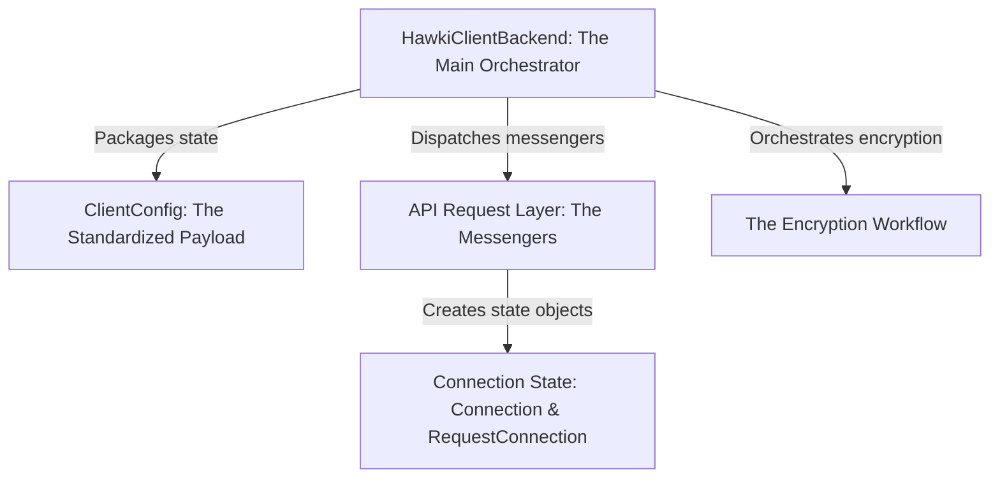

# Tutorial: hawki-client-backend-php

The `hawki-client-backend-php` library acts as a **secure bridge** between your PHP backend and the HAWKI authentication
system. Its primary job is to securely determine a user's connection status by talking to the HAWKI API. The library
handles a complex *end-to-end encryption* process, resulting in a secure payload for your frontend that indicates
whether to show a connected status or a QR code invitation.

**Source Repository:
** [git@github.com:hawk-digital-environments/hawki-client-backend-php.git](git@github.com:hawk-digital-environments/hawki-client-backend-php.git)

## Chapters

1. [Getting Started](getting-started-929492837.md)
1. [bin/env - Your local dev helper](bin-env-your-local-dev-helper-862670637.md)
1. [`HawkiClientBackend`: The Main Orchestrator](hawkiclientbackend-the-main-orchestrator-840305559.md)
1. [Connection State: `Connection` & `RequestConnection`](connection-state-connection-requestconnection-1400742608.md)
1. [`ClientConfig`: The Standardized Payload](clientconfig-the-standardized-payload-335005859.md)
1. [API Request Layer: The Messengers](api-request-layer-the-messengers-80603215.md)
1. [The Encryption Workflow](the-encryption-workflow-262429037.md)
1. [Infrastructure](infrastructure-610545213.md)
1. [CI/CD Pipeline](ci-cd-pipeline-610418824.md)
