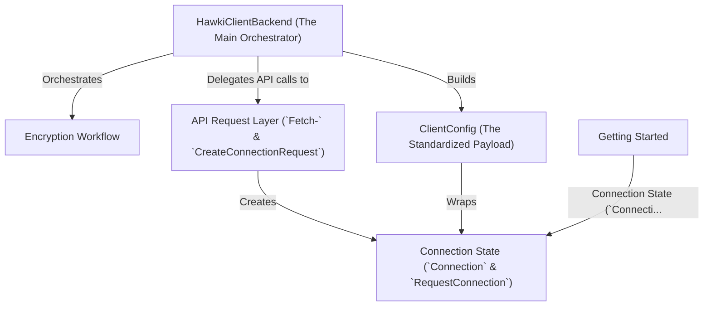

# Tutorial: hawki-client-backend-php

This project is a PHP library that acts as a **secure bridge** between your application and a HAWKI instance. It
simplifies managing user connections by handling all the complex API communication and *cryptography*. The library's
main job is to create a secure, **encrypted configuration payload** for a frontend client, indicating whether a user is
already connected or needs to start a new connection request.

## Chapters

1. [Getting Started](getting-started_929492837.md)
2. [Connection State (`Connection` & `RequestConnection`)](connection-state-connection-requestconnection_1088094409.md)
3. [`HawkiClientBackend` (The Main Orchestrator)](hawkiclientbackend-the-main-orchestrator_1464278974.md)
4. [`ClientConfig` (The Standardized Payload)](clientconfig-the-standardized-payload_1483722428.md)
5. [API Request Layer (`Fetch-` &
   `CreateConnectionRequest`)](api-request-layer-fetch-createconnectionrequest_22978743.md)
6. [Encryption Workflow](encryption-workflow_611751868.md)
