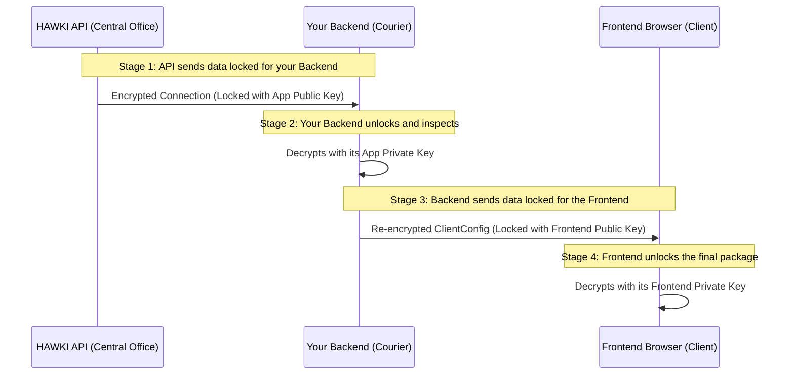

# Chapter 5: The Encryption Workflow

In [Chapter 4: API Request Layer: The Messengers](api-request-layer-the-messengers-80603215.md), we learned how specialized "messenger" classes communicate with the HAWKI API. We saw that when `FetchConnectionRequest` finds an existing user, it brings back a `Connection` object containing encrypted data. We even saw a `.decrypt()` method being called.

But why all this work? Why is this process of decrypting and then immediately re-encrypting so critical? Why not just pass the data through?

This chapter dives into the heart of the library's security model: the **"decrypt-then-re-encrypt" workflow**. This process is designed to guarantee that a user's sensitive secrets—like their personal API keys—are never exposed in a readable format anywhere except for two safe places: your secure backend server and the end-user's own browser.

### The Problem: Sending a Secret Message Securely

Imagine you need to send a highly confidential document from a central office (the HAWKI API) to a specific client (the frontend browser). You have a trusted courier (your backend) who will handle the delivery.

If the central office gives the document to the courier in a plain, unsealed envelope, anyone who intercepts the courier could read it. That's not secure.

A much better approach is the "two-lock box" strategy:
1.  The central office puts the document in a box and locks it with a key that **only the courier has**.
2.  The courier receives the box, unlocks it with their key, verifies the contents, puts them into a **new box**, and locks that new box with a key that **only the final client has**.

This way, the document is *always* inside a locked box during its journey. This is exactly how the `hawki-client-backend-php` library handles your users' secrets.

### The Two-Lock Encryption Workflow

This library's encryption workflow can be broken down into four main stages, which mirror our courier analogy perfectly.



Let's look at each stage in detail.

#### Stages 1 & 2: Decrypting the Data from HAWKI

When your backend (the courier) asks the HAWKI API for a user's details, the API sends back a `Connection` object. The sensitive parts of this object are encrypted. They are "locked" using your **Application's Public Key** (which you configured in HAWKI).

Your backend is the only one who has the matching **Application Private Key**. It uses this key to "unlock" the data. This is exactly what happens when the `decrypt()` method is called on a `Connection` object inside `HawkiClientBackend`.

**File: `src/HawkiClientBackend.php`**
```php
// Inside getClientConfig()...
$payload = (new FetchConnectionRequest($localUserId))->execute($this->client);

if ($payload) {
    // === STAGES 1 & 2 HAPPEN HERE ===
    // The payload is a Connection object with encrypted data.
    // We decrypt it using our application's private key.
    $payload = $payload->decrypt($this->hybridCrypto, $this->privateKey);
}
```
The `$this->privateKey` here is your application's secret private key—the key to the first lockbox. This call reaches into the `Connection` object and uses your private key to securely read the user's secrets.

At this point, for a brief moment, the user's secrets exist in a decrypted state inside your server's memory. Now your server can prepare the final package for the frontend.

#### Stages 3 & 4: Re-Encrypting for the Frontend

Now that your backend has the verified, decrypted information, it can't just send it to the frontend. That would be like the courier taking the document out of the first box and handing it over unprotected!

Instead, your backend must put the data into a new "lockbox" intended only for the final recipient—the user's browser. To do this, it needs the **Frontend's Public Key**. The frontend client generates a unique key pair for each session and sends its public key along with its very first request.

Your backend takes the entire payload (wrapped in a [Chapter 3: `ClientConfig`: The Standardized Payload](clientconfig-the-standardized-payload-335005859.md)), and encrypts it using this frontend public key. This step happens at the very end of the `getClientConfig()` method.

**File: `src/HawkiClientBackend.php`**
```php
// ... final part of getClientConfig()
return new EncryptedClientConfig(
    // === STAGE 3 HAPPENS HERE ===
    $this->hybridCrypto->encrypt(
        json_encode(new ClientConfig($payload), JSON_THROW_ON_ERROR),
        // Encrypt with the frontend's public key!
        $this->asymmetricCrypto->loadPublicKeyFromWeb($publicKey)
    )
);
```
The `$publicKey` variable holds the public key sent from the browser. The result is a secure, encrypted package that can be safely sent over the internet to the user.

Finally, in **Stage 4**, the frontend client receives this encrypted package. Since only it holds the matching private key, it can securely unlock the package and access the configuration and user secrets. Your backend has successfully acted as a secure intermediary without ever exposing the secrets to eavesdroppers.

### Conclusion

You have now learned the most critical security concept in `hawki-client-backend-php`: the "decrypt-then-re-encrypt" workflow.

-   **First Decryption:** Data from the HAWKI API is unlocked on your server using your application's **private key**. This confirms the data's authenticity and lets your server prepare it.
-   **Second Encryption:** The complete payload for the frontend is re-encrypted using the frontend's temporary **public key**, ensuring only the user's browser can read it.
-   **Ultimate Security:** This two-lock strategy ensures that sensitive user secrets are only ever in a readable, unencrypted state in two places: briefly on your secure server, and finally inside the end user's browser. They are never exposed "on the wire."

Congratulations! You have now journeyed through all the core concepts of the `hawki-client-backend-php` library, from the high-level orchestrator down to the intricate details of its security model. You are now well-equipped to integrate HAWKI into your PHP application securely and effectively.

## Bridging Security to Scalability: Introducing Infrastructure

With the "decrypt-then-re-encrypt" workflow now firmly in place, ensuring the highest levels of security in your HAWKI implementation, we shift our focus to the practical foundation that supports it all. No fortress stands without a solid base, and in the next chapter, [Infrastructure](infrastructure-610545213.md), we'll dive into the details of setting up and managing the project infrastructure that will host and scale your secure backend integration. From server configurations and deployment strategies to monitoring and maintenance, this chapter equips you with everything needed to deploy `hawki-client-backend-php` robustly in production environments. Let's build that foundation together.


